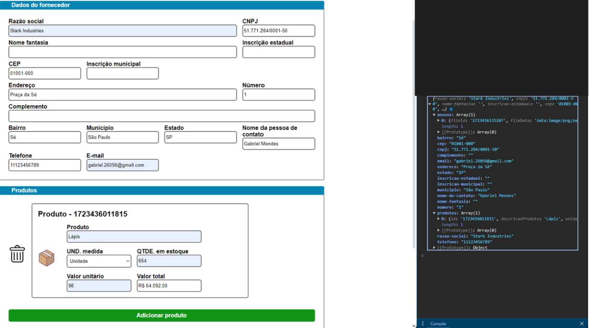

# Desafio front-end

Essa é a solução para o desafio front-end proposto pela @VFLOWS

## Conteúdo

- [Visão geral](#visão-geral)
  - [O desafio](#o-desafio)
  - [Screenshot](#screenshot)
  - [Links](#links)
- [O processo](#o-processo)
  - [Desenvolvido com](#desenvolvido-com)
- [Editando o projeto](#editando-o-projeto)

## Visão geral

### O desafio

O usuário deve ser capaz de:

- Adicionar dados do fornecedor
- Adicionar produtos e suas informações
  - O campo do valor total deve ser preenchido automaticamente, calculando o produto entre o valor unitário e a quantidade em estoque 
- Adicionar anexos
  - Os Anexos devem ser armazenados na memória, através de blobs e devem ser colocados no session storage

### Screenshot

### Links

- URL da página: [gabrielmendes21.github.io/desafio-frontend](https://gabrielmendes21.github.io/desafio-frontend/)

## O processo

### Desenvolvido com

- HTML
- CSS
- JavaScript
- ViaCEP API

- ## Editando o projeto

Para editar o projeto basta clonar o repositório abrindo o seu temrinal e rodando o comando:
`git clone https://github.com/gabrielMendes21/desafio-frontend.git`

Depois, acesse o repositório clonado:
`cd desafio-frontend/`

Caso você tenha algum erro de CORS, recomendo que instale a extensão `Live server` para rodar o projeto em um servidor local.
